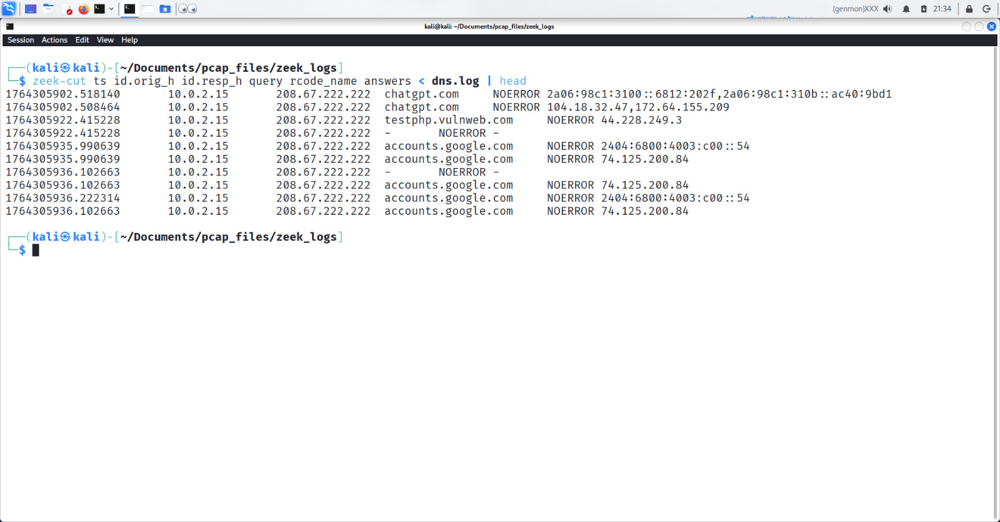

# Network Traffic Analysis (Zeek + Wireshark)

Hands-on blue-team style project analyzing network traffic in a controlled lab environment using **Zeek** and **Wireshark**.  
Focus: detecting abnormal **DNS** and **HTTP** behavior and building SOC-style investigation skills.

---

## 🎯 Project Overview

As part of my cybersecurity learning path, I built a small lab where I:

- Captured network traffic to **PCAP** files
- Parsed the traffic with **Zeek** to generate logs (`dns.log`, `http.log`, `conn.log`)
- Inspected packets and flows using **Wireshark**
- Identified **suspicious / abnormal DNS and HTTP patterns**
- Improved my detection accuracy over multiple lab iterations by developing a consistent analysis workflow

This project simulates the type of work done by a **SOC Analyst / Blue Teamer**.

---

## Tools & Technologies

- **Zeek** – Network security monitoring and log generation  
- **Wireshark** – Deep packet inspection and protocol analysis  
- **Kali Linux** – Lab environment  
- **tcpdump** – Packet capture  
- **Bash / CLI** – Filtering, parsing, and automation  

---

## 📁 Repository Structure

```text
network-traffic-analysis/
├── pcaps/         # Sample PCAP files used for analysis (if safe to share)
├── zeek_logs/     # Zeek output logs: dns.log, http.log, conn.log, etc.
├── scripts/       # Helper scripts (zeek-cut, filters, automation)
├── screenshots/   # Screenshots from Wireshark / logs / terminal
├── reports/       # Written analysis and findings
└── README.md      # This documentation
```

## DNS Traffic Analysis
Key things I looked at:
- Repeated DNS queries to the same suspicious domain
- High number of NXDOMAIN responses
- DNS queries to unusual top-level domains
- Unusual answer IP addresses
```bassh
  zeek-cut ts id.orig_h id.resp_h query rcode_name answers < dns.log | head
```
Example Screenshot:
```bassh
  screenshot/dns_analysis.jpg
```

## HTTP Traffic Analysis
Focus areas:
- Requests to suspicious paths (e.g., /test, /phpinfo.php, strange URIs)
- Suspicious User-Agent strings
- Repeated patterns that might indicate beaconing
```bassh
  zeek-cut ts id.orig_h id.resp_h method host uri referrer < http.log | head
```

Example Screenshot:
```bassh
  
```

## How to Reproduce This Lab
1. Capture or Obtain a PCAP
```bassh
  sudo tcpdump -i eth0 -w pcaps/lab_traffic.pcap
```

2. Run Zeek on the PCAP
from inside the project folder:
```bassh
  cd zeek_logs
  zeek-Cr ../pcap/lab_traffic.pcap
```
Zeek will generate files like:
- dns.log
- http.log
- conn.log

3. Explore logs with zeek-cut
   ```bassh
      zeek-cut ts id.orig_h id.resp_h query rcode_name answers < dns.log | head
   ```
